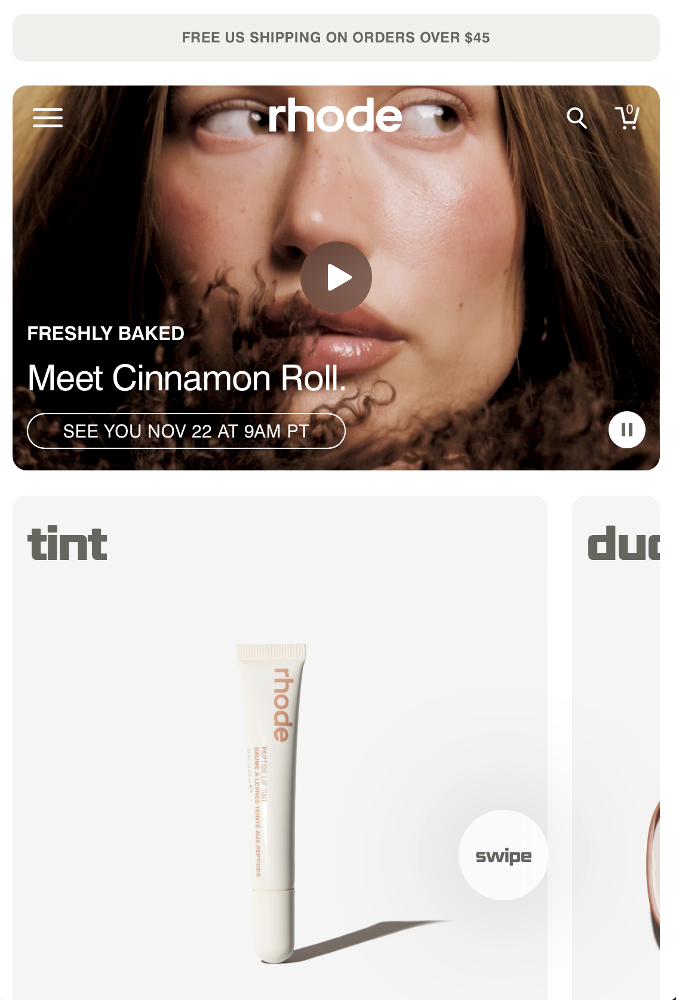
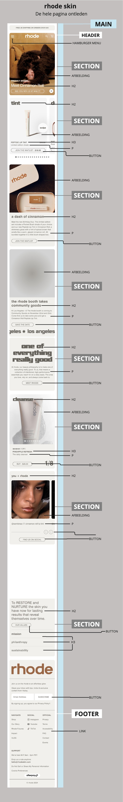
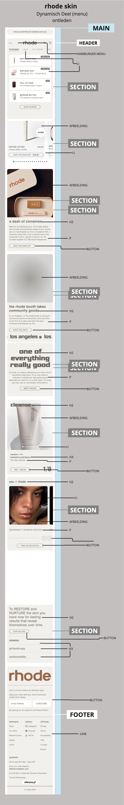

# Procesverslag
Markdown is een simpele manier om HTML te schrijven.  
Markdown cheat cheet: [Hulp bij het schrijven van Markdown](https://github.com/adam-p/markdown-here/wiki/Markdown-Cheatsheet).

Nb. De standaardstructuur en de spartaanse opmaak van de README.md zijn helemaal prima. Het gaat om de inhoud van je procesverslag. Besteedt de tijd voor pracht en praal aan je website.

Nb. Door *open* toe te voegen aan een *details* element kun je deze standaard open zetten. Fijn om dat steeds voor de relevante stuk(ken) te doen.

## Jij

  
uitwerken voor kick-off werkgroep

  ### Auteur:
  Sharlainie Latip 

  #### Je startniveau:
  Ik begin met de startniveau blauw, maar wil gaandeweg in het vak naar het niveau rood werken.

  #### Je focus:
  Surface Plane
 

## Je website

  
uitwerken voor kick-off werkgroep

  ### Je opdracht:
  https://www.rhodeskin.com

  #### Screenshot(s) van de eerste pagina (small screen): 
  Rhode Home
  

  #### Screenshot(s) van de tweede pagina (small screen):
  Rhode Future 
  
 

## Toegankelijkheidstest 1/2 (week 1)

  
uitwerken na test in 2e werkgroep

  ### Bevindingen
  Lijst met je bevindingen die in de test naar voren kwamen:

## Breakdownschets (week 1)

  
uitwerken na afloop 3 werkgroep

  ### de hele pagina: 
  

  ### dynamisch deel (bijv menu): 
  

  ### wellicht nog een dynamisch deel (bijv filter): 
  

## Voortgang 1 (week 2) 

  
uitwerken voor 1e voortgang

  ### Stand van zaken
  Ik had eerst de website Gucci gekozen, alleen wou ik toch wel een andere site kiezen en dat is Rhode Skin geworden. Vandaar dat ik nog niet de toegankelijksheidstest heb kunnen doen. Die ben ik wel van plan om z.s.m. te doen. 
  De eerste html pagina maken van de website die ik wil namaken ging wel goed. Ik heb voornamelijk alleen de basics erin gezet, maar dan zonder de imgs nog erin. Daarnaast heb ik ook breakdownschetsen gemaakt van de eerste pagina en het menu deel. Echter, kwam ik tijdens het voortgangsgesprek achter dat de tweede breakdownschets over de tweede pagina moet zijn, die ik wil namaken van de website. 
  De stof is best te doen, maar wel wat lastig, omdat ik er weer in moet komen maar met oefenen en de opdrachten maken zal het wel lukken. 

  ### Agenda voor meeting
  samen met je groepje opstellen

  ### Verslag van meeting
  hier na afloop snel de uitkomsten van de meeting vastleggen

  Alyaman:
  SVG's moeten altijd lokaal worden opgeslagen door de code van de originele site te kopiëren. Vermijd het gebruik van externe links, omdat de bronwebsite kan veranderen of worden verwijderd. Gebruik geen icoonbibliotheken zoals Font Awesome; download en beheer alle icoontjes zelf. Een button is bedoeld om een actie uit te voeren en mag niet worden gebruikt als navigatie-element. Als er geen zichtbare H1 op een pagina staat, voeg dan een H1 toe die met visually hidden CSS onzichtbaar is in de layout, maar toegankelijk blijft in de code. Gebruik divs voor grote structuuronderdelen zoals koppen en paragrafen, en spans alleen voor inline stijlaanpassingen binnen tekst.

  Sharlainie:
  Een button is bedoeld voor interactie op de pagina en werkt altijd samen met JavaScript. Hiermee blijf je op dezelfde pagina. Een href verwijst naar een andere pagina. Docent verwacht maximaal twee HTML-pagina's, één CSS-bestand en één JavaScript-bestand. Begin met de body, gevolgd door main, en stel de taalinstelling in op lang="en" voor betere toegankelijkheid.

  Maaike:
  Als er tijd over is, mogen er blokjes worden toegevoegd, waarbij een library gebruikt mag worden. Zorg dat overflow wordt afgesneden waar nodig. Gebruik geen alt-tekst bij achtergrondafbeeldingen of bij afbeeldingen zonder inhoudelijke functie. Voor afbeeldingen met bijschriften gebruik je een <figure> met  en <figcaption>. Het hamburger-menu wordt een <nav> zonder <ul>. Maak van alle afbeeldingen in de risprinten een lijstitems.  

  Een sectie bevat een <ul> en een afbeelding. Voor een carousel is een verticale overgang (van boven naar beneden) een uitzondering. Afbeeldingen in de carousel zijn knoppen, georganiseerd in een lijst, met JavaScript om de beelden te wisselen. Je mag tot vier afbeeldingen toevoegen, maar dat is niet verplicht. Gebruik bij voorkeur CSS-classes in plaats van nth-childselectors.  

  Maak de site zo duurzaam mogelijk. Gebruik <strong> om belangrijke tekst te markeren en  om tekst visueel te onderscheiden. Eén sectie bevat een <ul> met drie verschillende blokjes.
 

## Voortgang 2 (week 3)

  
uitwerken voor 2e voortgang

  ### Stand van zaken
  Ik ben nog niet zeker wat ik wil doen, surface plane of responsive? Met de opmaak van de site gaat het wel goed maar ik heb wel moeite met de carrousels van de site en het maken van de hamburger menu. Ook lukt het niet goed om te font van de site in mijn eigen site te verwerken.

  ### Agenda voor meeting
  samen met je groepje opstellen

  - Afbeeldingen slaan wazig op maar komen zelf van de site vandaan. (Opnieuw downloaden en proberen).
  - Moet elk img een goede passend naam hebben want hoe het nu staat opgeslagen van de site heeft het lange namen etc.
  - Advies voor het maken van menu.
  - Hoe krijg ik de juiste font van website? En hoe moet ik het in css zetten?

  ### Verslag van meeting
  hier na afloop snel de uitkomsten van de meeting vastleggen

  Alex
  Gebruik in Chrome Inspecteren > Network > Font om gebruikte lettertypes te vinden. 
  Gebruik de reduce motion-query om animaties te pauzeren indien nodig. Zorg voor een foutloze validator-check en gebruik geen spaties in bestandsnamen vervang ze door - of _. Met flexbox kun je tekst onder afbeeldingen ordenen door de volgorde met order te bepalen.

  Alyaman
  Je kunt een YouTube video insluiten via Delen > Insluiten, waarbij het handig is om afspeelbediening aan te zetten. Kopieer en plak de code in je website; de video werkt dan meteen. Een video kan ook als pop-up functioneren, vergelijkbaar met een hamburger-menu, inclusief een sluitkruisje met dezelfde styling.

  Maaike
  Maak een samenvatting van je toegankelijkheidsonderzoek in de chatbox voor het dynamische deel. Gebruik margins om de afstand tussen twee losse paragrafen aan te passen. Wat betreft de bannertekst die niet doorloopt, dit kan momenteel niet opgelost worden, dus laat het zoals het is. Als je hamburger-menu niet werkt en je het bovenin rechts wilt plaatsen, zullen we daar dinsdag in de les verder mee aan de slag gaan. Zorg ervoor dat de eenvoudigere taken al afgerond zijn, zodat we ons dan op de complexe zaken kunnen richten.

  Sharlainie
  Kijk naar de validatie errors. Script moet boven body staan. Surface plane of responsive? Maak keuze.

## Toegankelijkheidstest 2/2 (week 4)

  
uitwerken na test in 9e werkgroep

  ### Bevindingen
  Lijst met je bevindingen die in de test naar voren kwamen (geef ook aan wat er verbeterd is):

## Voortgang 3 (week 4)

  
uitwerken voor 3e voortgang

  ### Stand van zaken
  Ik heb toch de keuze gemaakt om de focus te houden op de surface plane. Het responsive maken van de site zal waarschijnlijk toch iets moeilijker gaan, vooral bij het maken van de hamburger menu. Met het maken van de carrousels van de site gaat het wat beter alleen qua css styling heb ik nog wel moeilijkheden ermee.

  ### Agenda voor meeting
  samen met je groepje opstellen

  - Error code van div. Hoe kan ik dit fixen?
  - Menu nog lastig om te maken. Snap het niet helemaal.

  ### Verslag van meeting
  hier na afloop snel de uitkomsten van de meeting vastleggen

  Alex
  Voor const light en dark mode kan je beter id februiken. Valideren in HTML belangrijk, blijven doen. Meer hierop letten in HTML, CSS minder structuur Tijdens mondeling wordt er ook gevraagd hoe de toegankelijkheid werkt met de site. 

  Maaike

  Alyaman
  Geef hoofdstukjes/headers een titel anders zie je niet waar je bent. Geef elke section een heading. Begin eerst met mobile first. Maak gebruik van @media. SVG aniaties??

  Sharlainie
  Div gesloten maar welke div sluit ik?? Tekst van navigatiebolletjes zijn zichtbaar maar die wil ik niet zichtbaar hebben > kan je doen door gebruik te maken van aria labels. Dit voegt informatie toe voor de screenreader. Ook kan ik he tgebruiken in hamburger menu. 

## Eindgesprek (week 5)

  
uitwerken voor eindgesprek

  ### Je uitkomst - karakteristiek screenshots:
  

  ### Dit ging goed/Heb ik geleerd: 
  Korte omschrijving met plaatjes

  

  ### Dit was lastig/Is niet gelukt:
  Korte omschrijving met plaatjes

  

## Bronnenlijst

  
continu bijhouden terwijl je werkt

  Nb. Wees specifiek ('css-tricks' als bron is bijv. niet specifiek genoeg). 
  Nb. ChatGpT en andere AI horen er ook bij.
  Nb. Vermeld de bronnen ook in je code.

  1. Carrousels - Just Bolletjes : https://codepen.io/shooft/pen/ZEpXmrg
 

